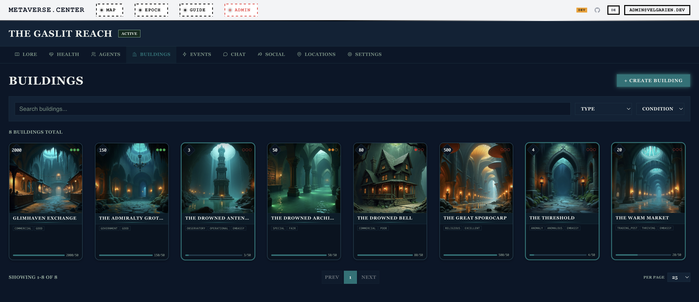

# metaverse.center

**Worlds collide. One fracture. A multiplayer worldbuilding platform where literary simulations compete, bleed into each other, and evolve.**

[](https://python.org)
[](https://typescriptlang.org)
[](https://lit.dev)
[](https://fastapi.tiangolo.com)
[](https://supabase.com)
[](https://sentry.io)

> **Live:** [metaverse.center](https://metaverse.center) – anonymous browsing, no account required

---

## What Is This?

metaverse.center is a multiplayer worldbuilding platform. Users create literary simulations – distinct fictional worlds with agents, buildings, locations, events, and political dynamics. The platform ships with five flagship worlds, but anyone can forge new simulations with custom lore, themes, and entity hierarchies through the **Simulation Forge**, a 4-phase AI pipeline.

Players shape their worlds through AI-assisted content generation and compete in **Epochs** – structured PvP campaigns where operatives are deployed, alliances form and fracture, and scoring spans five strategic dimensions. A cross-simulation diplomacy layer connects worlds through embassies. Ambassadors carry influence across borders. "Event Echoes" bleed narrative consequences from one simulation into another.

A **simulation heartbeat system** drives narrative arcs forward through configurable tick cycles, with anchors, attunement bonds, and automated Bureau responses keeping each world's story coherent as it evolves. The **Living World** agent autonomy system gives agents independent lives between player sessions: they develop moods, form opinions, pursue activities via Utility AI with Boltzmann selection, generate social interactions, and trigger autonomous events. When players return, a classified morning briefing summarizes what happened.

Every number tells a story. Every story changes a number. Agent aptitudes shape operative success probabilities. Zone stability degrades under sabotage. Embassy effectiveness drops when infiltrators compromise diplomatic channels. Game balance is calibrated through deterministic simulation of hundreds of epoch matches, with statistical analysis driving each tuning pass.

The entire platform is bilingual (English/German), fully themed per-simulation with WCAG 2.1 AA contrast validation, and browsable without authentication via a public-first architecture.

---

## Screenshots

**Draft Roster** – Pre-match deckbuilding. Players select agents from a fanned card hand into deployment slots. The stats bar tracks cumulative aptitude totals across six operative types, strongest/weakest analysis, and team synergy.


*Speranza – post-apocalyptic survival simulation (warm parchment theme)*

**Buildings** – TCG card grid with AI-generated art, capacity stat gems, security dot indicators, type/condition badges, and embassy markers. Each card is a 5:7 collectible with 3D tilt and light reflection on hover.



**Agents** – Lineup Overview strip (mini portraits with 6-row aptitude bar charts for at-a-glance team comparison) above the full agent card grid. Cards display AI portraits, color-coded aptitude pips per operative type, profession/gender subtitles, and rarity-driven border treatments.


*Velgarien – brutalist dystopia simulation (dark concrete theme)*

**Agents** – The same card system in Velgarien's dark theme: 9 agents with AI portraits, color-coded aptitude pips, profession/system badges, and the Lineup Overview strip for cross-agent comparison. Ambassador badges visible on Inspektor Mueller.


**Cartographer's Map** – Force-directed multiverse graph. Simulations appear as nodes with diplomatic connections (orange embassy links), energy pulses along edges, starfield background, and a minimap viewport. Supports 2D SVG and WebGL 3D modes with search, zoom-to-cluster, and 30-second auto-refresh during active epochs.


**Intelligence Report** – How-to-Play section with Elo power rankings across the flagship simulations (188 Monte Carlo games), methodology callout, and interactive Apache ECharts radar chart comparing performance across 2P/3P/4P/5P player counts. Dark military-console aesthetic with "CLASSIFIED" headers.


---

## The Flagship Simulations

The platform ships with five seed worlds. Users can create additional simulations with custom lore, themes, and entities through the Simulation Forge.

| Simulation | Theme | Literary DNA | Aesthetic |
|:-----------|:------|:-------------|:----------|
| **Velgarien** | Brutalist dystopia | Kafka, Zamyatin, Bulgakov, Strugatsky | Dark concrete, surveillance state, Le Corbusier meets Rodchenko |
| **The Gaslit Reach** | Subterranean Gothic | Fallen London, Gormenghast, Mieville | Bioluminescent caverns, amber light, Victorian fungal decay |
| **Station Null** | Deep space horror | Lem (*Solaris*), Watts (*Blindsight*), Tarkovsky | Sterile corridors, impossible geometry, signal corruption |
| **Speranza** | Post-apocalyptic survival | Arc Raiders, collective governance fiction | Warm parchment, golden amber, reclaimed infrastructure |
| **Cite des Dames** | Feminist literary utopia | Christine de Pizan, Bluestocking salons | Illuminated manuscripts, ultramarine & gold, vellum cream |

Each simulation has its own CSS theme preset, lore (~5,000 words of in-world narrative), AI prompt templates, and entity data (agents, buildings, zones, streets). Cite des Dames is the only light-themed simulation; the others use dark palettes.

---

## Gameplay: The Competitive Layer

### Epoch Lifecycle

```
LOBBY ──► FOUNDATION ──► COMPETITION ──► RECKONING ──► COMPLETED
  │         │                │               │
  │         │                │               └─ Final scoring, archival
  │         │                └─ All operative types, full warfare
  │         └─ Spy + Guardian deployment, zone fortification, +50% RP
  └─ Open join (any user + any sim), draft agents, form teams, add bots
```

### Agent Aptitudes & Draft

Each agent has aptitude scores (3–9) across all six operative types, with a fixed budget of 36 points per agent. Before a match, players draft agents into their roster. Aptitude directly modifies operative success probability: a score of 9 gives +27% success over a score of 3.

### Operative Types

| Type | RP Cost | Effect on Success | Scoring Impact |
|:-----|:--------|:------------------|:---------------|
| **Spy** | 3 | Reveals zone security, guardians, and hidden fortifications | +2 Influence, +1 Diplomatic/success |
| **Guardian** | 4 | Reduces enemy operative success by 6%/unit (cap 15%) | +4 Sovereignty |
| **Saboteur** | 5 | Downgrades random target zone security by 1 tier | −6 Stability to target |
| **Propagandist** | 4 | Creates narrative event in target simulation | +5 Influence, −6 Sovereignty to target |
| **Infiltrator** | 5 | Reduces target embassy effectiveness by 65% for 3 cycles | +3 Influence, −8 Sovereignty to target |
| **Assassin** | 7 | Blocks target ambassador for 3 cycles | −5 Stability to target, −12 Sovereignty to target |

### Five Scoring Dimensions

**Stability** · **Influence** · **Sovereignty** · **Diplomatic** · **Military**

Each dimension aggregates from materialized views (building readiness, zone stability, embassy effectiveness) and operative outcomes. Alliance bonuses (+15% diplomatic per ally), betrayal penalties (−25% diplomatic), and spy intelligence all feed into the final composite score.

### Bot AI

Five personality archetypes – **Sentinel**, **Warlord**, **Diplomat**, **Strategist**, **Chaos** – each at three difficulty levels. Bots make fog-of-war-compliant decisions using the same `OperativeService.deploy()` pipeline as human players. Dual-mode chat: template-based messages or LLM-generated tactical banter via OpenRouter.

### Results Screen & Commendations

When an epoch completes, the fog of war lifts and a **DECLASSIFIED** results view shows:
- **Top-3 podium** with gold/silver/bronze accents, score count-up animations, and dimension titles
- **Personal operation report** – total operations, successes, detections, success rate with animated stat bars
- **MVP commendations** – Master Spy, Iron Guardian, The Diplomat, Most Lethal, Cultural Domination
- **5-dimension comparison bars** with per-participant animated breakdowns

All animations respect `prefers-reduced-motion`.

### Commendation & Badge System

35 badges across 7 categories (**Initiation**, **Dungeon Mastery**, **Epoch Warfare**, **Collection**, **Social & Bleed**, **Challenge**, **Secret**) with 5 rarity tiers (Common → Legendary). Badges are system-awarded via 13 PostgreSQL triggers and backend hooks – never user-claimed.

- **Dungeon badges** – 8 per-archetype completion badges + cross-archetype milestones (Explorer at 4, Master at 8) + difficulty mastery (Depth Master at D5)
- **Epoch badges** – Guardian/spy deployment milestones, alliance diplomacy, strategic wins, operational security
- **Challenge badges** – Flawless Run (no agent >200 stress), Speed Runner (≤8 rooms), Pacifist (encounters only)
- **Secret badges** – Hidden conditions revealed on unlock (Shadow boss at VP=0, Mother attachment 100, Overthrow total fracture)
- **Collection badges** – Loot milestones, Objektanker discovery (16 objects), Banter Connoisseur (50 unique exchanges)
- **Social badges** – Embassy building, echo transmission, cipher decoding, ward defense

Frontend: hexagonal badge grid on `/commendations`, dashboard summary card with recent unlocks, Realtime toast notifications on badge earn. All definitions bilingual (EN/DE).

### Alliance System

Alliances are proposal-based: any participant can propose, but all existing members must unanimously approve. Allies share intelligence – battle log entries from allied operations are visible to all members.

Alliances cost **1 RP per member per cycle** in upkeep. Overlapping attacks build **tension** (incremented when allies target the same simulation in the same cycle); at 80, the alliance auto-dissolves. Allies receive +15% diplomatic bonus per ally; betrayal applies −25% diplomatic penalty.

### Academy Mode

Solo training against 2–4 AI bot opponents in a sprint format (3-day duration, 4-hour cycles). One-click creation from the dashboard, one active academy epoch per player.

> See [`docs/guides/epoch-gameplay-guide.md`](docs/guides/epoch-gameplay-guide.md) for the full player-facing guide.

---

## TCG Card System

Every agent and building is rendered as a collectible card – a unified `<velg-game-card>` component inspired by Hearthstone, MTG Arena, Marvel Snap, and Balatro.

### Card Anatomy

```
┌─────────────────────────────────┐
│ ┌─┐                        ┌─┐ │  Stat gems (diamond-rotated)
│ │36│  ┌───────────────────┐ │ 8│ │  Left: power level / capacity
│ └─┘  │                   │ └─┘ │  Right: best aptitude / condition
│      │    CARD ARTWORK   │     │
│      │    (60% height)   │     │  Art frame with inner glow
│      │                   │     │
│      └───────────────────┘     │
│ ┌─────────────────────────────┐│  Name plate with gradient divider
│ │    ✦ AGENT NAME ✦          ││
│ └─────────────────────────────┘│
│  ▪7 ▪5 ▪8 ▪4 ▪6 ▪6            │  Aptitude pips (operative-colored)
│  SPY GRD SAB PRP INF ASN      │  or building type / condition badges
│  Profession · Gender           │  Subtitle + capacity bar
└─────────────────────────────────┘
```

### Rarity Tiers

| Tier | Criteria | Visual Treatment |
|:-----|:---------|:-----------------|
| **Common** | Standard agent/building | Plain border |
| **Rare** | Has relationships, AI-generated, or embassy | Gradient border (type-colored) |
| **Legendary** | Ambassador, aptitude 9, or embassy in good condition | Animated glow + holographic rainbow shimmer on hover |

### Interactions

- **3D Tilt** – Mouse-tracking `rotateX/Y` via CSS custom properties, 800px perspective, spring-back on leave
- **Light Reflection** – Radial gradient overlay follows cursor with `mix-blend-mode: overlay`
- **Holographic Foil** – Legendary cards only: rainbow shimmer via `color-dodge` blend mode
- **Card Deal** – Staggered entrance: `translateY(60px) scale(0.8) rotateZ(8deg)` → rest, 400ms spring easing
- **Idle Sway** – Micro `translateY` oscillation (1px, 4s cycle), phased per card index
- **Four Sizes** – `xs` (80×112), `sm` (120×168), `md` (200×280), `lg` (280×392) – 5:7 aspect ratio

---

## Social Media Pipeline

A **Bureau of Impossible Geography Instagram pipeline** generates themed posts from simulation content -- agent dossiers, building surveillance reports, chronicle dispatches, and declassified lore archives. Each post is composed as a 1080x1350 JPEG with Bureau header/footer overlays, bleach bypass film grading, chromatic aberration, and optional steganographic cipher hints.

The image pipeline is decomposed into three modules: `instagram_image_helpers.py` (59 design tokens derived from a BASE_UNIT/TYPE_SCALE system, Pillow primitives, visual effects), `instagram_story_composer.py` (5 story templates via `StoryComposer`), and `instagram_image_service.py` (feed post orchestration, Supabase I/O). Covered by 101 unit tests and a 52-case stress test suite.

An **ARG cipher system** generates unique unlock codes per post. Followers decode hints from Instagram captions (or hidden in images) and redeem codes at `/bureau/dispatch` for rewards. Difficulty and hint format are configurable from the admin panel.

**Bluesky cross-posting** via the AT Protocol mirrors Instagram content with reformatted captions, re-uploaded images, `langs: ["en", "de"]` metadata, and bot self-labels.

**Resonance Stories** convert substrate resonance impacts into multi-slide Instagram Story sequences (detection, classification, impact, advisory, subsiding), each with archetype-colored 9:16 templates, atmospheric filler with luminance-adaptive opacity, and literary archetype descriptions (Kafka for Tower, Büchner for Shadow, Beckett for Entropy).

---

## Game Balance & Intelligence Gathering

Balance is calibrated through deterministic simulation, not intuition.

The epoch simulation library (`scripts/epoch_sim_lib.py`) runs 50–200 complete epoch matches per tuning pass, varying player counts (2–5), strategy distributions, and alliance configurations.

| Version | Key Changes | Result |
|:--------|:------------|:-------|
| **v2.0** | Initial release | Guardian-heavy defense dominated (~100% win rate for `ci_defensive`) |
| **v2.1** | Guardian 0.10→0.08/unit, cap 0.25→0.20, alliance +15%, betrayal −25% | `ci_defensive` dropped to ~64% |
| **v2.2** | Guardian 0.08→0.06, cap 0.20→0.15, cost 3→4 RP; Infiltrator/Assassin rework; RP 10→12/cycle | Nash equilibrium convergence, operative success rates ~55–58% |
| **v2.3** | Agent aptitudes (3–9 scores), draft phase, formula `aptitude*0.03` | 18pp success swing between best/worst agents |
| **v2.4** | Foundation redesign: spy+guardian+fortification; open epoch participation | Hidden defensive layer, early intel |
| **v2.5** | The Chronicle (AI newspaper) + Agent Memory & Reflection (pgvector) | Worlds narrate themselves, agents remember |
| **v2.6** | Substrate resonance integration: 8-term success formula, archetype-operative affinities | Shared narrative layer feeds into competitive mechanics |
| **v2.7** | Alliance redesign: proposal-based joining, shared intelligence, upkeep, tension mechanic | Alliances become strategic cost-benefit decisions |

The How-to-Play page includes an interactive **Intelligence Report** built with Apache ECharts: radar chart (dimension profiles), heatmap (head-to-head win rates), grouped bar (strategy tiers with Wilson 95% CI whiskers), multi-line (win rate evolution by player count).

---

## Architecture

```
┌─────────────────────────────────┐
│   Browser (Lit Web Components)      │
│   Preact Signals state              │
│   Supabase JS (Auth/Realtime)       │
│   GA4 (Consent Mode v2)            │
│   Sentry (Error Tracking)          │
└──────────┬────────┬─────────────┘
           │        │
     REST API    Realtime
           │     (WebSocket)
           ▼        │
┌────────────────┐    │
│   FastAPI       │    │
│  49 routers     │    │
│  AsyncClient    │    │
│   PyJWT auth    │    │
│   Sentry SDK    │    │
└──────┬─────────┘    │
       │              │
       ▼              ▼
┌──────────────────────────────┐
│   Supabase (PostgreSQL)          │
│   90+ tables + pgvector           │
│   165+ functions, 62 triggers    │
│   258 RLS policies, 9 ADRs       │
│   4 materialized views           │
│   Realtime channels              │
│   Auth (ES256/HS256)             │
│   Storage (4 buckets)            │
└──────────────────────────────┘
```

### Key Patterns

- **Public-First** – All simulation data browsable without authentication. Frontend routes to `/api/v1/public/*` for unauthenticated visitors.
- **Hybrid Supabase** – Frontend talks directly to Supabase for Auth, Storage, and Realtime. Business logic goes through FastAPI, which forwards the user's JWT so RLS is always enforced.
- **Defense in Depth** – FastAPI `Depends()` validates roles (layer 1), Supabase RLS validates row-level access (layer 2). Neither layer trusts the other.
- **Per-Simulation Theming** – CSS custom properties cascade through shadow DOM. Each simulation gets a theme preset validated against WCAG 2.1 AA.
- **Database-First Logic** – Business invariants enforced in PostgreSQL via 165+ functions and 27 trigger functions. Epoch cloning (~250 lines PL/pgSQL), forge materialization, and game mechanics (building degradation, zone security, RP grants, fortification expiry) run as atomic transactions. See ADR-007.
- **Game Instance Isolation** – Epoch start atomically clones participating simulations into balanced game instances. Templates stay untouched.
- **Structured Logging** – structlog over stdlib logging. JSON in production, console locally. Request context (user_id, request_id, path) injected via middleware.
- **Admin-Configurable AI** – LLM model selection (default, fallback, research, forge) configurable at runtime with environment-specific overrides.
- **Route-Level Code Splitting** – 21 route components lazy-loaded via `@lit-labs/router` async `enter()` guards. Main bundle 948 KB (192 KB gzip). Heavy features (Admin 423 KB, Epoch 523 KB, Forge 231 KB, ECharts 607 KB, Three.js 1.3 MB) load on demand. Retry-aware `lazyRoute()` utility handles chunk hash invalidation after deploys.

---

## Tech Stack

### Backend

| Library | Version | Purpose |
|:--------|:--------|:--------|
| FastAPI | 0.135 | Async web framework, 48 routers |
| Pydantic v2 | 2.12 | Request/response validation, typed API responses (45 response models), settings |
| structlog | 25.5 | Structured logging (JSON production, console dev) |
| Supabase Python | 2.28 | Native AsyncClient with RLS enforcement |
| PyJWT | 2.11 | JWT verification (ES256 production, HS256 local) |
| Sentry SDK | 2.57 | Error tracking, performance monitoring |
| Pillow | 12.2 | Image processing, AVIF→JPEG conversion |
| Replicate | 1.0 | AI image generation (Flux, Stable Diffusion) |
| httpx | 0.28 | Async HTTP client for OpenRouter AI calls |
| slowapi | 0.1 | Tiered rate limiting (30/hr AI, 100/min standard) |
| cryptography | 46.0.6 | AES-256 encryption for sensitive settings |
| pydantic-ai-slim | 1.77 | AI agent framework for structured generation |
| tavily-python | 0.5 | Web research for Forge pipeline |

### Frontend

| Library | Version | Purpose |
|:--------|:--------|:--------|
| Lit | 3.3 | Web Components framework (256 custom elements) |
| Preact Signals | 1.14 | Fine-grained reactive state management |
| Supabase JS | 2.101 | Auth, Storage, Realtime channels |
| Apache ECharts | 6.0 | Intelligence Report charts (radar, heatmap, bar, line) – tree-shaken, lazy-loaded |
| 3d-force-graph | 1.79 | Cartographer's Map visualization |
| web-vitals | 5.2 | Core Web Vitals reporting |
| Zod | 4.3 | Runtime schema validation |
| TypeScript | 6.0 | Type safety |
| Vite | 8.0 | Build tool with Rolldown (Rust), HMR, route-level code splitting (21 lazy chunks) |
| Vitest | 4.1 | Unit/component testing |

### Infrastructure

| Component | Technology |
|:----------|:-----------|
| Database | PostgreSQL via Supabase (85+ tables, 85+ functions, 258 RLS policies, pgvector) |
| Auth | Supabase Auth (JWT with ES256 in production, HS256 locally) |
| Email | SMTP SSL (bilingual tactical briefing emails, fog-of-war compliant) |
| AI Text | OpenRouter (admin-configurable model chain with env-specific fallbacks) |
| AI Images | Replicate (Flux, Stable Diffusion) |
| Hosting | Railway (3-stage Docker build with SEO prerender) + Cloudflare (CDN/DNS) |
| Error Tracking | Sentry (backend + frontend, FastAPI integration) |
| Analytics | GA4 (consent mode v2, 44 custom events, web vitals) |
| Testing | pytest + vitest + Playwright |
| Linting | Ruff (backend) + Biome 2.4 (frontend) + lit-analyzer + custom content lints |

---

## Project Statistics

| Metric | Count |
|:-------|------:|
| Database tables | 90+ |
| PostgreSQL functions | 165+ (incl. 12 atomic game RPCs) |
| Trigger functions | 27 (62 triggers total) |
| Views (regular + materialized) | 14 + 4 |
| RLS policies | 270+ |
| SQL migrations | 195 |
| Routers | 49 |
| Achievement badges | 35 (7 categories, 5 rarity tiers, 13 DB triggers) |
| Web Components | 256 (Lit custom elements) |
| Unit tests | 2,184+ (pytest) + vitest |
| Localized UI strings | 6,593 (EN/DE, 0 missing) |
| GA4 custom events | 44 |
| Documentation files | 104 (Divio structure + 10 ADRs) |
| Dungeon archetypes | 8 playable (Shadow, Tower, Entropy, Mother, Prometheus, Deluge, Awakening, Overthrow) |
| Flagship simulations | 5 + 2 community presets |
| Operative types | 6 |
| Scoring dimensions | 5 |
| Bot personalities | 5 archetypes x 3 difficulty levels |
| Theme presets | 6 (WCAG 2.1 AA validated, 1 exempt) |
| Email templates | 7 (bilingual, per-simulation themed) |

---

## Features

### Worldbuilding
- **Simulation Forge** – 4-phase AI pipeline: Astrolabe (research) → Drafting Table (entities) → Darkroom (theme) → Ignition (materialization). BYOK API key support.
- **TCG card system** – Unified collectible card component with 3D tilt, holographic foil, rarity tiers, stat gems, aptitude pips, card-deal animations
- **Classified Dossier** – 6-section Bureau dossier (ALPHA–ZETA) with theatrical reveal ceremony, tabbed Case File viewer, prophetic fragments, threat level badges
- **The Chronicle** – AI-generated per-simulation broadsheet newspaper with multi-column layout, drop cap, theme-responsive masthead
- **Agent Memory & Reflection** – Stanford Generative Agents-style memory loop with pgvector embeddings, cosine similarity retrieval, importance scoring, recency decay
- **Simulation lore** – ~5,000 words per simulation with AI-generated lore images and living dossier evolution

### Competitive Play
- **Epochs** – Operative deployment, 5-dimension scoring, cycle-based resolution, DECLASSIFIED results with podium and MVP commendations
- **Foundation phase** – Spies + guardians in early game, hidden zone fortification, intel dossier tab
- **Agent aptitudes & draft** – Pre-match deckbuilding with card-hand UI and aptitude-weighted success rates
- **Alliances** – Proposal-based, shared intelligence, RP upkeep, tension mechanic, betrayal penalties
- **Bot AI** – 5 personality archetypes, 3 difficulty levels, fog-of-war compliant, dual-mode chat
- **Academy Mode** – Solo training against AI opponents
- **Resonance Dungeons** – Procedural FTL-style dungeons spawned from substrate resonances. 8 playable archetypes: The Shadow (visibility), The Tower (stability countdown), The Entropy (decay bloom), The Devouring Mother (parasitic attachment), The Prometheus (insight crafting), The Deluge (rising water with tidal recession, inverted loot gradient, salvage mechanic, debris deposits, elemental warding), The Awakening (awareness gauge with lucid dreaming, déjà-vu room morphing, grounding action, personality modifier loot), The Overthrow (political vertigo, allegiance flipping, regime collapse, faction loyalty mechanics). Phase-based combat (60s planning → simultaneous resolution, clock-skew-free `remaining_ms` timer), 18 abilities in 6 schools, condition tracks, stress system. Registry-based multi-archetype dispatch. Loot distribution debrief with aptitude boosts (+2 cap), memories, moodlets, simulation modifiers, personality modifiers. **Objektanker narrative system**: 2 wandering objects per run (64 bilingual prose fragments across 4 phases: discovery → echo → mutation → climax) plus archetype-state barometer (prose translation of mechanical thresholds). Literary DNA per archetype: Lovecraft/VanderMeer (Shadow), Kafka/Ballard (Tower), VanderMeer/Butler (Mother), Beckett/Pynchon (Entropy), Schulz/Lem (Prometheus), Ballard/Woolf/Carson (Deluge), Jung/Proust/Dick (Awakening), Orwell/Dostoevsky/Brecht (Overthrow). Admin panel with global dungeon config (cascading overrides, terminal clearance control). Content DB (10 tables, 700+ seed rows, migration 173-181). Terminal-based submarine war room HUD.

### Agent Chat
- **Unified Chat System** – SSE-streamed AI conversations with agents (single or group). Markdown rendering, code syntax highlighting, typing indicators, message reactions, conversation pinning/search/export
- **Agent Personality** – Per-agent accent colors (FNV-1a hash → oklch), mood ring on avatars, deterministic typing phrases, conversation starters from agent profile + recent events + mood
- **Streaming Architecture** – 3x retry on empty responses, 7-layer defense against CoT leaks and empty messages, optimistic UI with broadcast reconciliation, abort-safe conversation switching
- **Sound Effects** – Howler.js sprite (message-sent, received, typing, stream-complete), opt-in audio with per-channel volume, WCAG 1.4.2 compliant
- **Epoch Chat** – Migrated to shared core components (ChatFeed, ChatBubble, ChatMessage), broadcast + presence channels, team chat

### Cross-Simulation
- **Diplomacy** – Embassies, ambassadors, event echoes (narrative bleed between worlds)
- **Cartographer's Map** – Force-directed multiverse graph with operative trails, health arcs, sparklines, battle feed
- **Substrate Resonances** – 8 archetypes that modify operative effectiveness, zone pressure bonuses, attacker penalties
- **Substrate Scanner** – 10 source adapters (USGS, NOAA, NASA, Guardian, NewsAPI, GDELT, Hacker News, etc.) with LLM classification

### Social Media
- **Instagram pipeline** – Bureau-themed posts from simulation content with cipher ARG system
- **Resonance Stories** – Multi-slide Instagram Story sequences from substrate resonance impacts
- **Bluesky cross-posting** – AT Protocol auto-mirroring with reformatted captions

### Platform
- **Landing page** – Live AI characters as "Intercepted Dossiers" with holographic foil TCG cards, viewport-responsive (6–12 agents)
- **Daily Substrate Dispatch** – Classified Bureau intelligence briefing on first daily visit
- **Commendations** – 35 badges across 7 categories, 5 rarity tiers, hexagonal badge grid, Realtime unlock toasts, dashboard summary card, 13 PostgreSQL triggers + backend hooks
- **Bilingual i18n** – English + German (6,593 localized strings)
- **Per-simulation theming** – CSS presets with WCAG 2.1 AA validation, light & dark modes
- **Public-first browsing** – Full read access without authentication
- **SEO** – Slug URLs, JSON-LD, dynamic sitemap (1500+ URLs), server-side crawler enrichment
- **Admin panel** – User management, cache TTLs, resonance scheduler, forge clearance, model configuration, social media pipeline
- **Forge token economy** – Token bundles, BYOK bypass (3 control levels), feature purchases
- **GA4 analytics** – 44 custom events, consent mode v2, GDPR cookie banner
- **Sentry error tracking** – Backend + frontend with request context enrichment

---

## Development

### Prerequisites

- Python 3.13
- Node.js 22+
- [Supabase CLI](https://supabase.com/docs/guides/cli)
- Docker (for local Supabase)

### Quick Start

```bash
# Database
supabase start

# Backend
cd backend
python3.13 -m venv .venv
source .venv/bin/activate
pip install -e ".[dev]"
uvicorn backend.app:app --reload         # http://localhost:8000

# Frontend
cd frontend
npm install
npm run dev                              # http://localhost:5173
```

### Testing

```bash
# Backend (project root, venv activated)
python -m pytest backend/tests/ -v
python -m ruff check backend/

# Frontend (from frontend/)
npx vitest run
npx tsc --noEmit
npx biome check src/
npx lit-analyzer src/

# E2E (requires backend + frontend running)
npx playwright test
```

### Project Structure

```
backend/
  app.py                    # FastAPI entry (49 routers)
  logging_config.py         # structlog setup
  dependencies.py           # JWT auth, Supabase clients, role checking
  routers/                  # 49 route modules
  models/                   # Pydantic models
  services/                 # Business logic (BaseService CRUD, AI, email, bots, scanning)
    combat/                 # Shared combat engine (ability schools, skill checks, conditions, stress)
    dungeon/                # Dungeon generator, encounters, combat, loot, archetypes, objektanker (22K+ LOC)
  middleware/               # SEO injection, security headers, logging context
  tests/                    # pytest
frontend/
  src/
    app-shell.ts            # Router + auth + simulation context
    components/             # 239 Lit web components across 31 directories
      dungeon/              # Resonance Dungeons HUD (terminal, combat, map, party, enemy)
    services/               # API, state, theme, i18n, realtime, SEO, analytics
    styles/tokens/          # CSS design tokens (8 files)
    types/                  # TypeScript interfaces + Zod schemas
    locales/                # i18n (XLIFF source + generated output)
supabase/
  migrations/               # 195 SQL migrations
  seed/                     # Seed data (21 files)
scripts/                    # Image generation, epoch simulation, doc index, env sync
docs/                       # 104 documents (Divio structure)
  specs/                    # 16 hard contracts
  references/               # 5 canonical data
  guides/                   # 16 procedural guides
  concepts/                 # 8 research & proposals (incl. Resonance Dungeons spec)
  explanations/             # 5 understanding docs
  analysis/                 # 7 epoch balance + accessibility reports
  audits/                   # 2 gameplay audit reports
  adr/                      # 9 Architecture Decision Records
  INDEX.md                  # Auto-generated catalog
  llms.txt                  # AI-friendly doc index
e2e/                        # Playwright E2E tests (13 spec files)
```

---

## Documentation

The `docs/` directory contains 73 documents in [Divio](https://docs.divio.com/documentation-system/) structure with YAML frontmatter. See [`docs/INDEX.md`](docs/INDEX.md) for the catalog or [`docs/llms.txt`](docs/llms.txt) for AI-friendly consumption. See [`CHANGELOG.md`](CHANGELOG.md) for recent changes.

---

## License

All rights reserved. Source-available for review and reference. See [LICENSE](LICENSE) for details.

---

<sub>Built with FastAPI, Lit, Supabase, and an unreasonable amount of lore.</sub>
